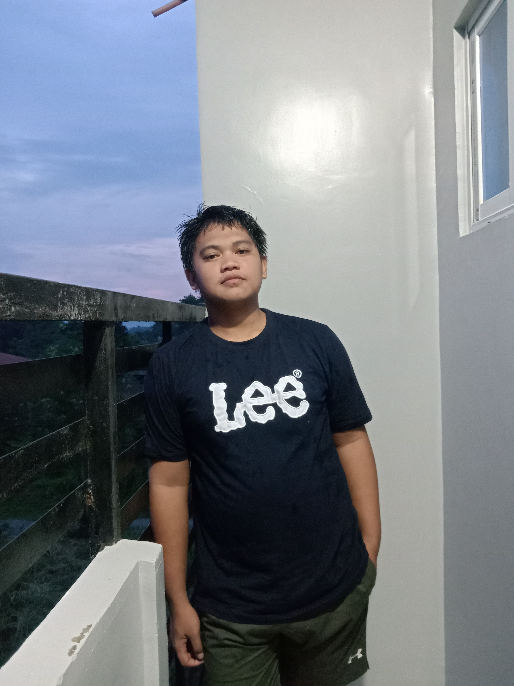
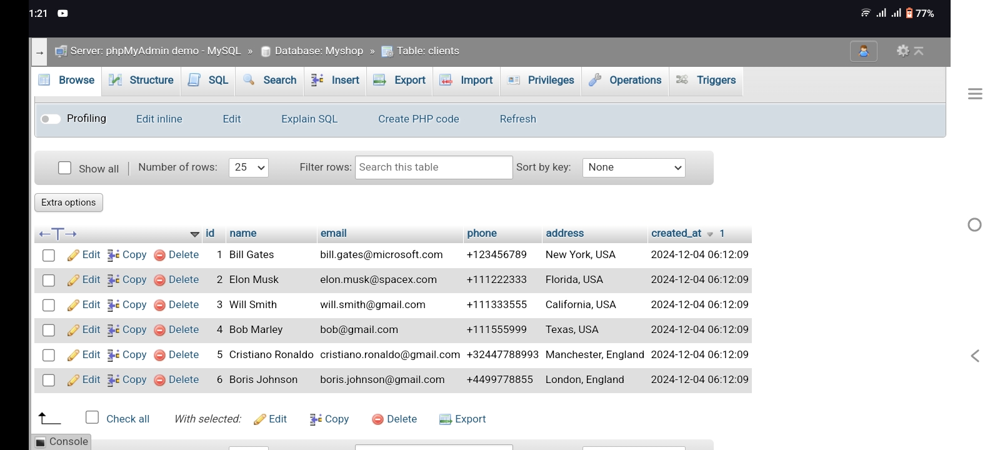
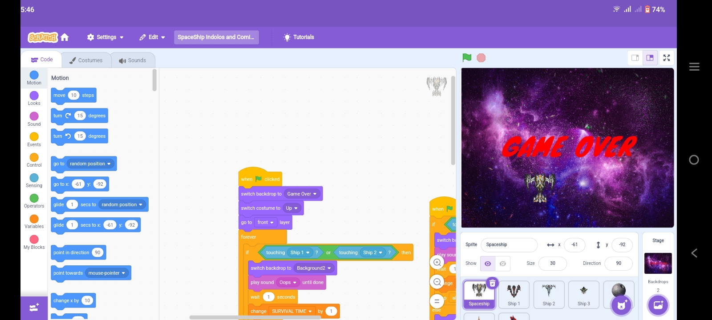

# ALJHON INDOLOS 
## About Me
Hi! I'm [ALJHON INDOLOS].
As a second-year IT student at Eastern Visayas State University (EVSU), building on the foundation of programming, networking, and database management skills gained in my first year. My academic journey is deepening with more advanced subjects, preparing my self for future challenges in the IT field.

My passion for learning goes beyond the classroom. My actively explore new technologies, participate in online courses, and engage with tech communities to stay up to date and expand my knowledge in areas like cloud computing and AI.

Looking ahead, my eager to gain hands-on experience through internships and explore specialized areas like cybersecurity and data science. My commitment to continuous learning and growth positions to become a well-rounded and successful IT professional.

# Skills
- Web Development
- Data Analysis
- Graphic Design

# Projects
•System 

•Scratch 

  

# Contact
- Email: aljhonindolos90k@gmail.com
- Phone: 09977228834
- Address: Ormoc City 

# services 

HTML
I design well-organized, user-friendly website structures with clear layouts and navigation. By focusing on intuitive menus, consistent design, and easy-to-find content, I aim to create a seamless and efficient browsing experience for users.

  
PYTHON
I use Python to solve problems and build projects, leveraging its simplicity to automate tasks, analyze data, and create applications. By exploring various libraries and frameworks, I continuously improve my skills and expand the scope of my projects.

  
JavaScript
I implement interactive features on websites, such as buttons, forms, and animations, to enhance user engagement and create a dynamic experience. Using technologies like JavaScript and jQuery, I design intuitive, responsive elements that make the website more interactive and enjoyable for users.

 CSS
I focus on creating visually appealing website designs by selecting colors, typography, and imagery that enhance the user experience. By ensuring a cohesive layout and clear visual hierarchy, I aim to make the site both attractive and easy to navigate, improving engagement and functionality.
